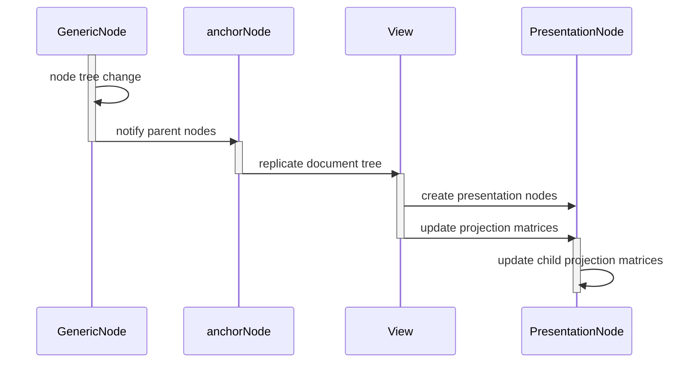
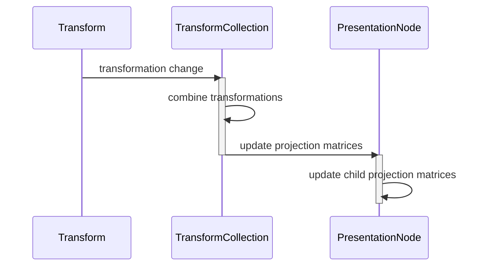

# Change notifications - daign-2d-pipeline

There are two types of changes that have to be handled in the application:
structural changes in the document tree and transformation changes.

### Structural changes

Each document is a tree of nodes.
When nodes are inserted or removed from the tree, then the tree has a new structure.

Every changed node will issue a change notification that is bubbling up the parent nodes.

The root node of the currently viewed sub tree is the anchor node.
When the change notification reaches the anchor node,
this causes the view to replicate the tree into a copy consisting of presentation nodes.

An update of projection matrices is invoked
on the root of the newly created tree of presentation nodes.
This triggers a recursive update of the projection matrices of each child node.

### Transformation changes

Several transformations on a single node are grouped inside of a transform collection.
When a transformation changes
then the combined transformation of the collection is recalculated.

Afterwards the presentation node is notified
that the transform collection of its source node was changed.

This triggers an update of the projection matrices of the presentation node
and recursively of all its children.

The projection matrices of presentation nodes higher up in the tree are not recalculated.
Likewise the tree of presentation nodes is not rebuilt.

